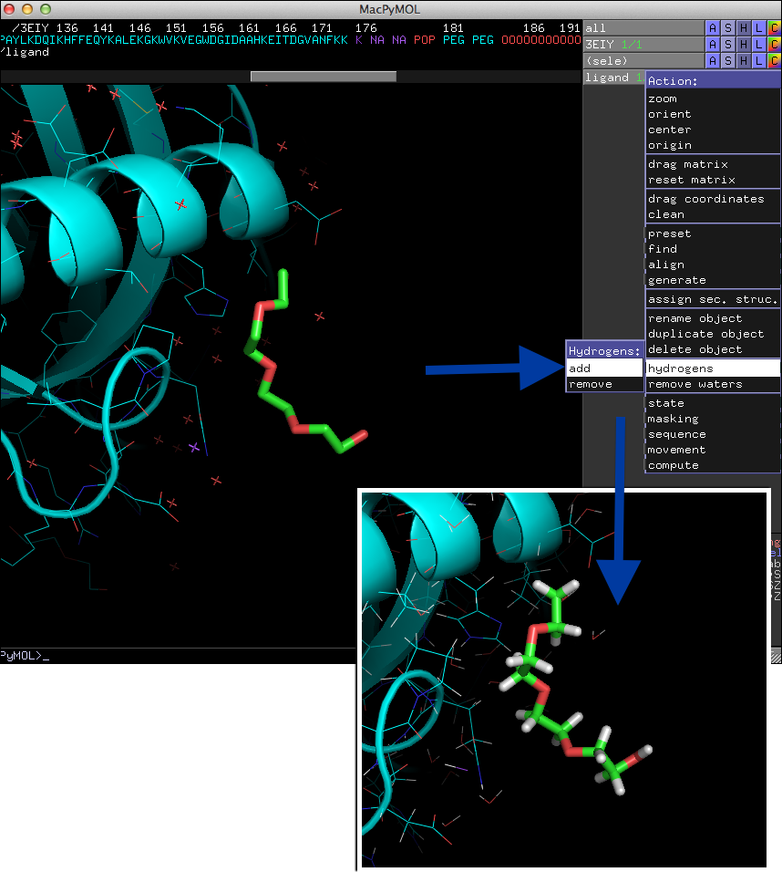
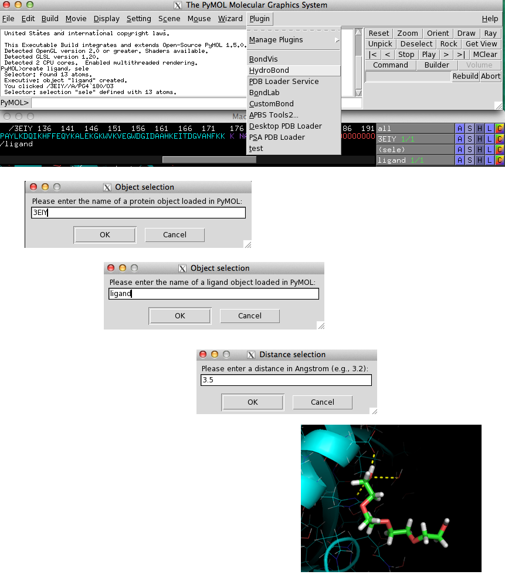
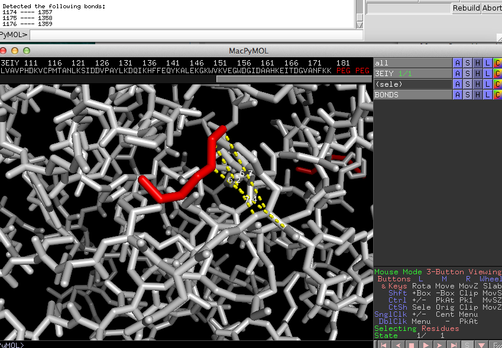
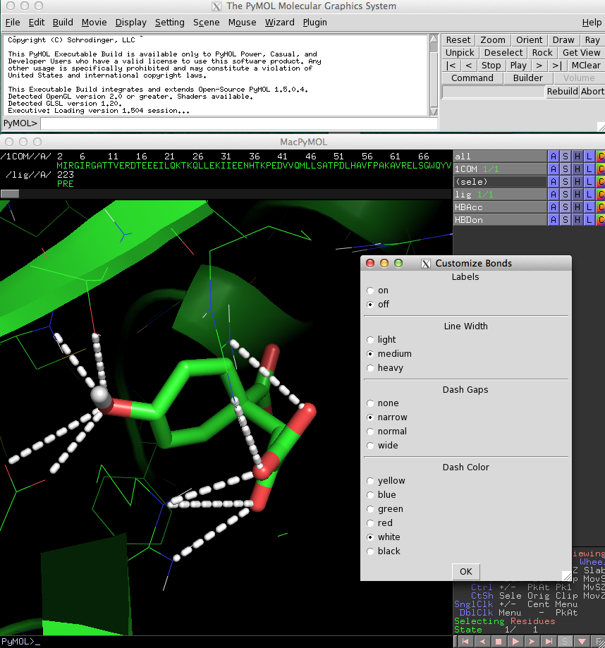
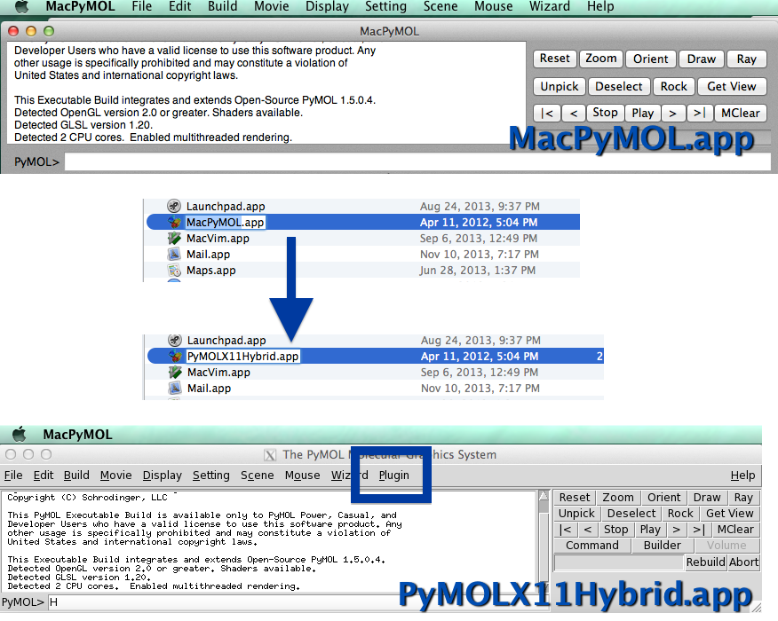
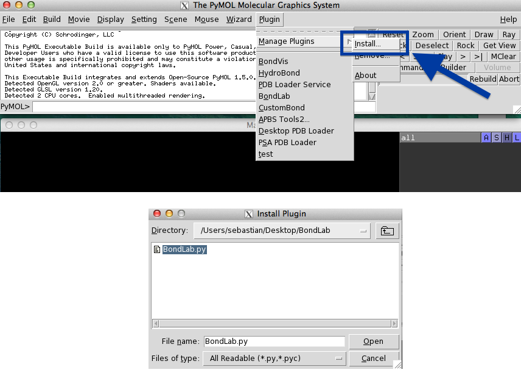

BondPack
========

A collection of PyMOL plugins to visualize atomic bonds.

#Introduction
PyMOL is without any doubt a great tool to visualize protein and ligand molecules. However, drawing interactions between atoms can be often quite cumbersome when done manually. For the sake of convenience, I developed three plugins for PyMOL that will make our life as protein biologists a little bit easier.  
All three PyMOL plugins can be installed and used separately; they don't depend on each other, but rather complement each other.
At the end of this article, you will find brief instructions on how to install plugins in PyMOL - a very quick and simple process.   

#HydroBond
HydroBond visualizes all potential polar contacts between protein and ligand molecules within a user-specified distance.   
The underlying function is based on the different atom types, such as hydrogen bond acceptor and donor atoms, and thus it is required to have hydrogen atoms present in the structure. If your structure file doesn't contain hydrogen atoms already, you can add them directly in PyMOL as shown in the image below.  

HydroBond is related to PyMOLs "[A]->find->polar contacts" command, however, it doesn't consider geometry criteria and angle thresholds, but is rather based on atom types.   
When you select HydroBond from the "Plugin" menu, you will be prompted to enter the name of the protein object, the ligand object, and a distance cutoff as shown in the figure below. If HydroBond was able to detect hydrogen bond and acceptor atoms within the specified distance, potential interactions will be visualized as yellow dashed lines.

#BondVis
The BondVis plugin lets you visualize interactions between any pair of atoms you specified.  
Often I find it helpful for my understanding (and for verification) to visualize the bonds between certain atoms that were assigned in docking or any other prediction software. Most software will provide you with information about the atoms that were "connected" to perform the analysis.
If you run BondVis from the "Plugin" menu, it will ask you to select a "bond info file." 

This is just a simple text file that contains the atom numbers of connected atoms in pairs. Those can be separated by spaces, tabs, or commas. An example file with bond information could look like this:  
<code><pre>1174		1357
1175		1358
1176		1359
</pre></code>
When you selected a "bond info" file, BondVis will connect all atom pairs by yellow dashed lines and print out the connected atoms in the command field.

#BondLab
If you are not happy with the looks of the lines that were drawn to visualize connections between atoms, you will like to use BondLab. This plugin offers a simple interface that allows you to change the diameter, gap width, and color of the lines. 

The following video demonstrates the different features of BondLab:
http://youtu.be/14UZctxtK3w

#Enabling Plugins in MacPyMOL
If you are a Mac user, you may have noticed that the UI looks a little bit different from PyMOL on Linux and Windows. I have to admit that it looks prettier on MacOS, but unfortunately, the "Plugin" tab is missing.
But there is a simple remedy. You just have to rename the "MacPyMOL.app" in the Applications folder to "PyMOLX11Hybrid.app" and you are good to go (you might have to install X11 to support the Tkinter UI if you haven't done so yet).

#Installing PyMOL Plugins
Installing new plugins is pretty straight forward in PyMOL. All you need to do is to click on the "Plugin" button in the menu bar, select "Manage Plugins," click on "Install...," and select the plugin file from the file browser window that pops up. After you restarted PyMOL, the new plugin will appear in the menu under "Plugin" and will be ready to use.
